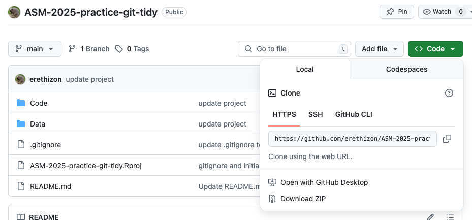
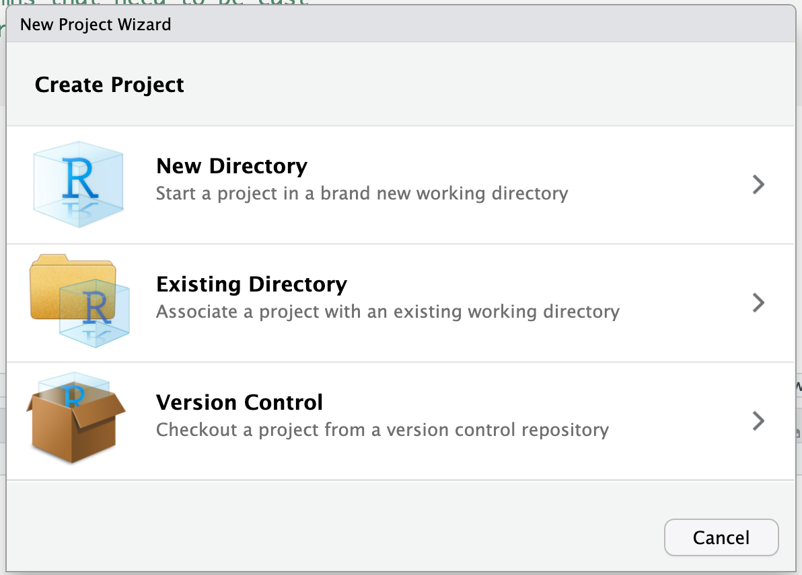
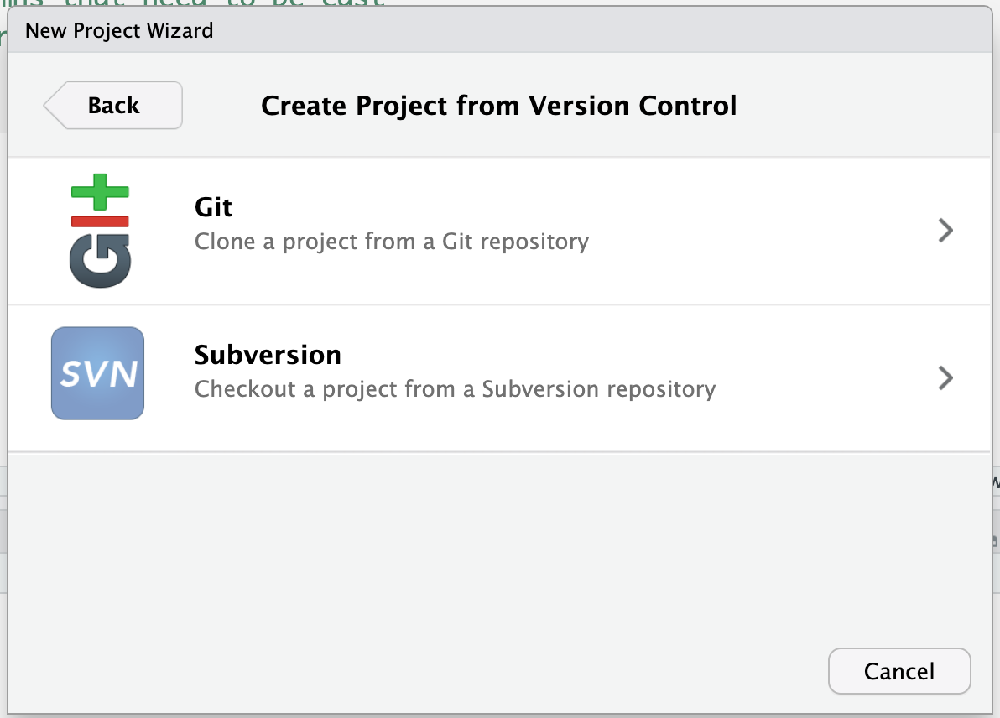
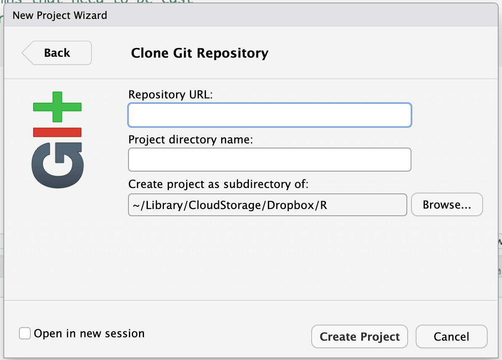

# ASM-2025-practice-git-tidy
## Overview
This repository provides some practice material to support the Reproducible Research in R workshop 
presented by [Marissa Dyck](https://github.com/marissadyck) and [Erika Barthelmess](https://github.com/erethizon) at the
2025 annual meeting of the American Society of Mammalogists.

More specifically, this is a repository designed to allow participants to learn to clone a repo, create a new RStudio
project from the repo, work with a tidy dataset, track and commit changes and push them to their own github.

## Instructions
You should already have an account on github and have git installed locally on your computer. Assuming that is the case:

To clone this repository and use it in RStudio, do the following:  

1. Visit the repository website and find the green "Code" button **(See up above on this page!)**. Click the down arrow, and **copy** the url that is displayed under HTTPS.     
      
     
.    
 
 

2. **In RStudio**, choose the File menu, and then select **"New Project."** When the dialog box opens, be sure to select **"Version Control"** as your option.     
 

     
 
 

3. When the Version Control dialog box opens, choose **git** as your version control method. 
 

    
 
 

4. When the next dialog box opens, **paste** the url you copied from github into the url box. You may wish to browse to a new subdirectory on your computer to create a new location for the RStudio project. If you leave "Project directory name" blank, your project will be named the same thing as the github repo.
 
 

 
 

## That should do it!

  
  

